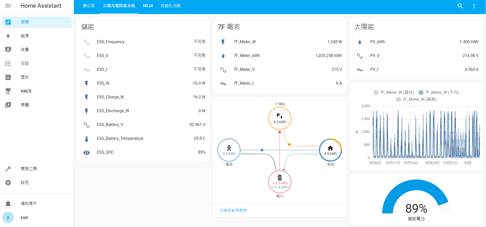

# HA


<b>非公開筆記 : </b>
<ul>
  <li><a href="https://hackmd.io/KGeOe7OfSJSMwnYqckX34w" target="__blank">Docker 觀念篇</a></li>
  <li><a href="https://hackmd.io/gIsnpqEmQAuCRYOTGBoZFw" target="__blank">Docker 實作篇</a></li>
</ul>
---

## Docker 安裝
* <b>卸載舊版本Docker</b>
```
$ sudo apt-get remove docker docker-engine docker.io containerd runc
```

* <b>安裝Docker</b>
```
$ sudo apt-get update && sudo apt-get upgrade
```

```
$ curl -sSL https://get.docker.com | sh​
```


* <b>讓非root也可使用</b>
```
$ sudo usermod -aG docker pi
```

* <b>查看版本</b>
```
$ docker -v
```


* <b>重啟</b>
```
$ sudo reboot
```

## Docker-compose 安裝
```
$ sudo apt-get upgrade
```
* <b>安裝 pip</b>
```
$ sudo apt install -y python3-pip libffi-dev
```
* <b>安裝 docker-compose</b>
```
$ sudo pip3 install docker-compose
```

* <b>查看 docker-compose 版本</b>
```
$ docker-compose -v
```


## 設定開機啟用docker
```
$ sudo systemctl enable docker
$ sudo reboot
```


